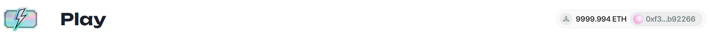
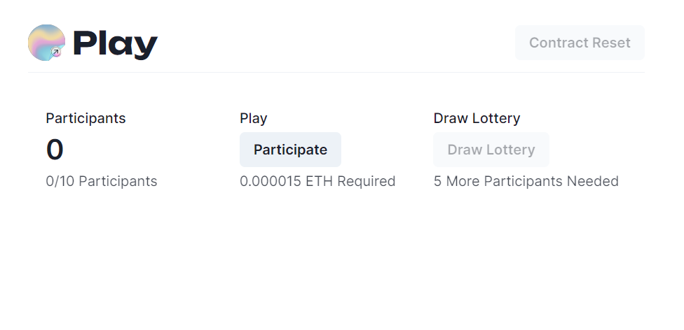
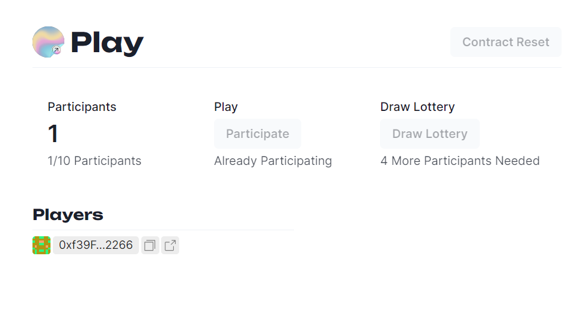
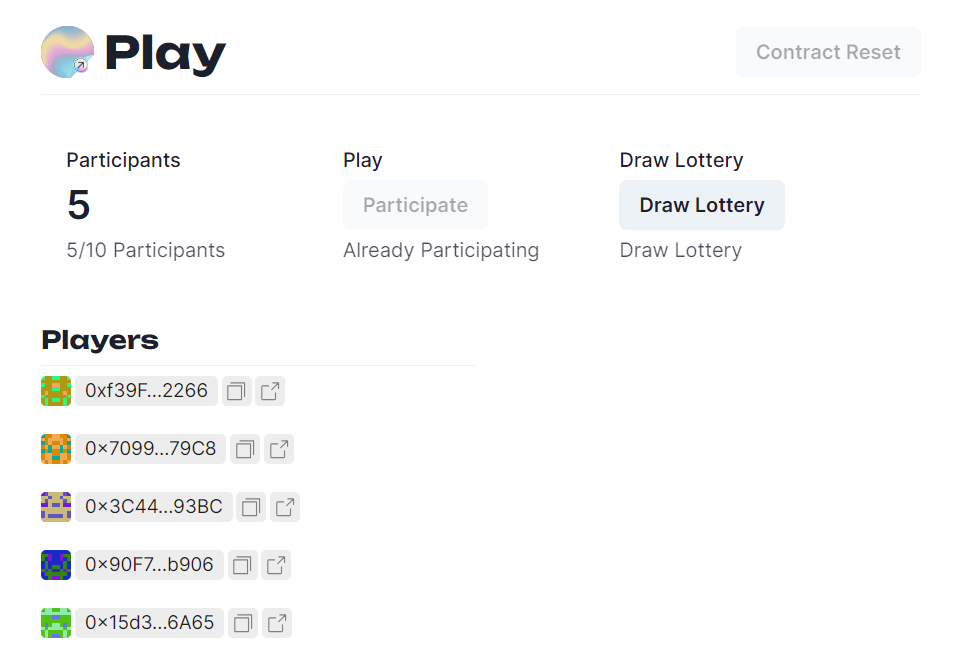
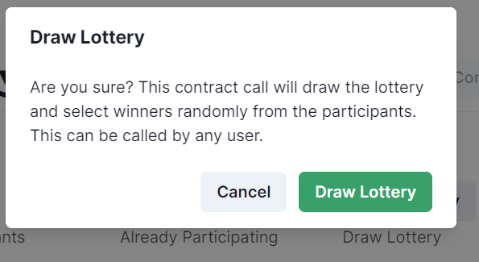
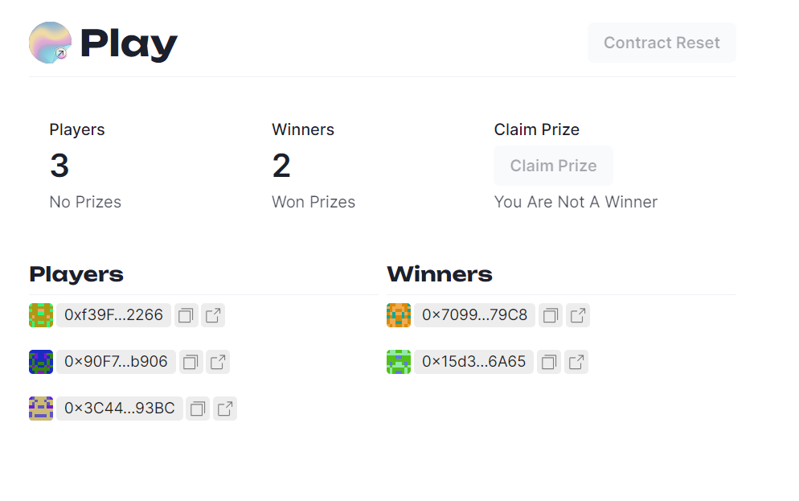
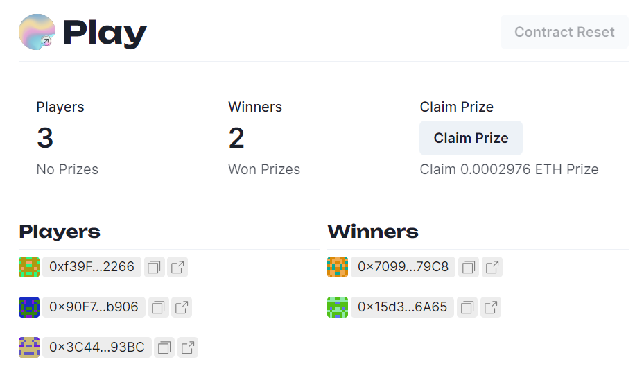
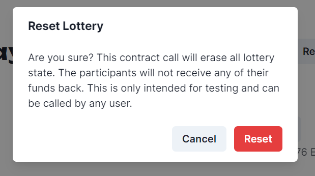

# Lottery

This is a lottery dApp that allows users to participate in an Ethereum lottery where more than one participants are chosen from the set of participants for prizes.

## Local Development

Since developing this project depends on a hardhat node running the lottery contract, clone the contracts repo and run the `npx hardhat node` command and deploy the Lottery contract on the local node.

Then, run the development server:

```bash
npm run dev
```

Open [http://localhost:3000](http://localhost:3000) with your browser to see the result.

## dApp Usage

1. Connect your wallet

2. Navigate to the Play route

3. Click on Participate and pay 0.000015 ETH.

4. Wait for at least 4 other participants. You can switch accounts and participate with other accounts.

5. Draw the lottery to assign winners.

6. Once drawn, the winners are announced.

7. In case you are a winner, you can claim your prize. First prize winner is assigned 60 percent of the prize pool and second prize winner is assigned 40 percent of the prize pool.

8. You can reset the lottery state by clicking on the reset lottery button at any time to test various scenarios. Note that unclaimed prizes are carried forward in case the state is reset which adds to the funds of next claims.


## Info

* Minimal usage of Tailwind CSS as most of the styling is done using emotion Chakra's latest version
* No usage of `React Hook Form` because all interactions are just button clicks.
* Ethers have been converted to hooks without using wagmi.
